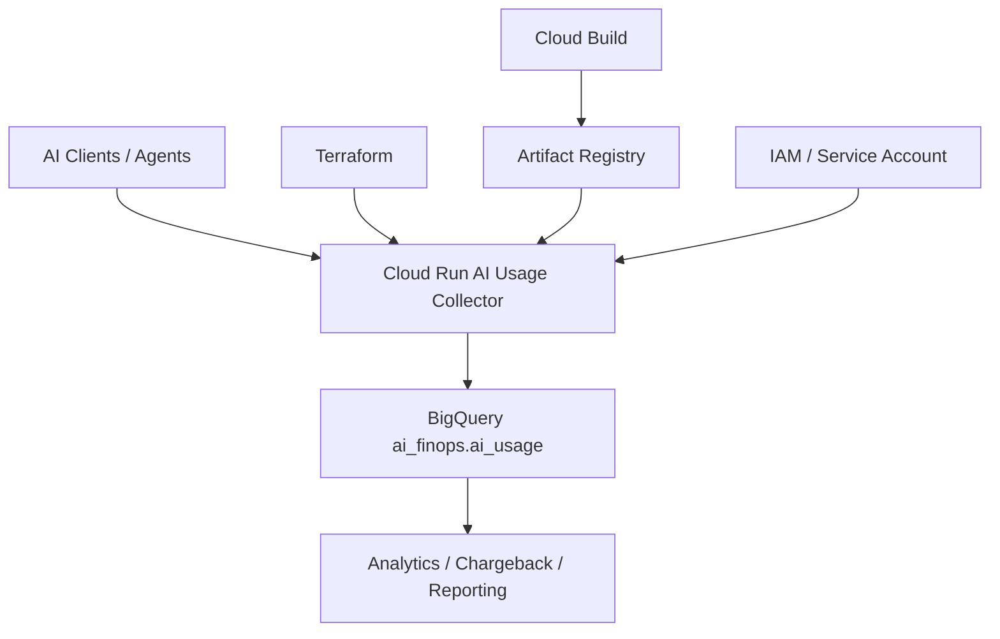

# AiOpsVista AI Usage Collector Platform Architecture

## Deployment Architecture

## Runtime Workflow

1. Cloud Build compiles the collector image and publishes it to Artifact Registry.
2. Terraform applies the Cloud Run service, service account, IAM bindings, and BigQuery access.
3. Cloud Run starts the collector with explicit CPU, memory, timeout, concurrency, and instance controls.
4. The collector validates `PROJECT_ID`, `DATASET_ID`, and `TABLE_ID` on startup.
5. Sample or real telemetry is normalized to the Case Study #003 schema.
6. The service writes rows to `ai_finops.ai_usage`.
7. BigQuery becomes the source for cost attribution, reporting, and future analytics.

## Security and FinOps Controls

- Public invocation is opt-in only
- `allUsers` bindings are not configured by default
- Runtime identity is isolated to the collector service
- BigQuery access is restricted to the target table
- Cloud Run is capped to one instance with conservative resource sizing

## As-Built Evidence

- Service: `ai-usage-collector`
- Region: `us-central1`
- Image: `us-central1-docker.pkg.dev/aiopsvista-market-dev/ai-usage-collector/ai-usage-collector:v1`
- Service Account: `ai-usage-collector@aiopsvista-market-dev.iam.gserviceaccount.com`
- Concurrency: `20`
- Min Instances: `0`
- Max Instances: `1`
