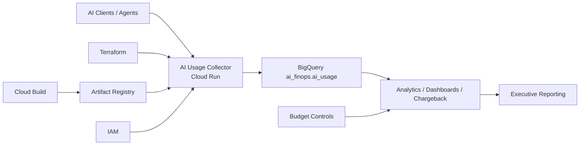

# AiOpsVista Case Study #004

## AI Usage Collector Platform for Enterprise AI FinOps

---

### 1. Executive Summary

Case Study #004 is complete.

This implementation delivered a production-style AI Usage Collector platform on Google Cloud Platform that collects AI telemetry events and stores them in the centralized `ai_finops.ai_usage` BigQuery data model established in Case Study #003.

The delivery proves the full enterprise path end to end:

- Terraform apply successful
- Cloud Build successful
- Artifact Registry successful
- Cloud Run deployment successful
- BigQuery integration successful
- Terraform destroy successful

The result is a reusable, secure, and low-cost foundation for AI FinOps, AI Reliability Engineering, consulting demonstrations, and the upcoming analytics and executive dashboard phase.

---

### 2. Business Problem

Organizations adopting OpenAI, Gemini, Claude, GitHub Copilot, and internal AI agents often lack a centralized way to collect usage events and convert them into operationally useful financial and reliability data.

Without a collection layer, teams cannot consistently answer:

- Which team is driving the highest AI spend?
- Which workflow or agent is most expensive?
- Which provider or model is least efficient?
- Which requests fail or time out most often?
- How do cost, reliability, and latency trend together over time?

Case Study #004 closes that gap by implementing the collector path that populates the Case Study #003 schema.

---

### 3. Architecture

### Delivered Components

| Layer | Delivered Capability |
| --- | --- |
| Artifact Registry | `ai-usage-collector` image repository |
| Cloud Build | Container build and publish workflow |
| IAM | Dedicated service account and least-privilege access |
| Cloud Run | AI Usage Collector service |
| BigQuery | `ai_finops.ai_usage` ingestion target |
| Terraform | Fully managed deployment and destroy workflow |

---

### 4. Implementation Summary

#### BigQuery Platform

| Property | Value |
| --- | --- |
| Dataset | `ai_finops` |
| Table | `ai_usage` |
| Partitioning | Daily partitioning on `event_timestamp` |
| Clustering | `provider`, `project_id`, `environment`, `team_name` |

#### Schema

The collector writes the full 17-column AI FinOps model:

- `event_timestamp`
- `provider`
- `model`
- `request_id`
- `user_id`
- `project_id`
- `team_name`
- `workflow_name`
- `agent_name`
- `request_count`
- `input_tokens`
- `output_tokens`
- `total_tokens`
- `estimated_cost`
- `latency_ms`
- `status`
- `environment`

#### Cloud Run Deployment Evidence

| Property | Value |
| --- | --- |
| Service | `ai-usage-collector` |
| Region | `us-central1` |
| Image | `us-central1-docker.pkg.dev/aiopsvista-market-dev/ai-usage-collector/ai-usage-collector:v1` |
| Service Account | `ai-usage-collector@aiopsvista-market-dev.iam.gserviceaccount.com` |
| Min Instances | `0` |
| Max Instances | `1` |
| Concurrency | `20` |

#### Cloud Build Evidence

| Property | Value |
| --- | --- |
| Build ID | `959ccddd-5b5f-4438-ae38-ddd423793c02` |
| Image Digest | `sha256:19dcfb3f657b616c7195af49f93de5e32754e235666e1998cf269b9f5e04b020` |

---

### 5. Troubleshooting Findings

#### Finding #1 - Cloud Build source fetch failure

- Error: `storage.objects.get denied`
- Root cause: build execution identity lacked access to the Cloud Build staging bucket
- Resolution: granted required bucket access to the compute service account
- Business value: demonstrates enterprise IAM troubleshooting

#### Finding #2 - Artifact Registry push failure

- Error: `artifactregistry.repositories.uploadArtifacts denied`
- Root cause: build identity lacked Artifact Registry write permissions
- Resolution: granted `roles/artifactregistry.writer`
- Business value: demonstrates CI/CD platform troubleshooting

#### Finding #3 - Cloud Run service not created

- Root cause: Cloud Run deployment is conditional on `container_image`
- Terraform logic: `count = var.container_image == "" ? 0 : 1`
- Resolution: build image, publish image, update `terraform.tfvars`, re-apply Terraform
- Business value: demonstrates a multi-stage platform deployment workflow

#### Finding #4 - HTTP 403 during validation

- Root cause: service intentionally configured with authenticated access only
- Evidence: no `allUsers` binding configured
- Business value: demonstrates secure-by-default enterprise architecture

#### Finding #5 - Terraform destroy failed

- Error: `cannot destroy service without setting deletion_protection=false`
- Root cause: Cloud Run deletion protection enabled
- Resolution: disable deletion protection, apply change, re-run destroy
- Business value: demonstrates production lifecycle management and safe teardown practices

---

### 6. Outcomes

Case Study #004 now proves that AiOpsVista can demonstrate:

- AI FinOps cost collection
- AI usage attribution by team, project, workflow, and agent
- Reliability telemetry collection alongside cost data
- Secure Cloud Run deployment with explicit IAM control
- Low-cost, repeatable deployment and teardown using Terraform

The platform now supports the progression:

Provision -> Govern -> Observe -> Collect -> Attribute

---

### 7. Evidence References

- [Evidence Package](../evidence/case-study-004/README.md)
- [Validation Record](../evidence/case-study-004/VALIDATION.md)
- [Implementation Record](../evidence/case-study-004/IMPLEMENTATION.md)
- [Implementation Gaps Fixed](../evidence/case-study-004/IMPLEMENTATION_GAPS_FIXED.md)

---

### 8. Next Phase

Case Study #005 will focus on AI FinOps analytics and the executive dashboard:

- BigQuery analytics views
- Looker Studio dashboards
- Cost attribution reports
- Team chargeback reports
- AI reliability reporting
- Executive AI spend dashboard
- Forecasting and optimization insights
