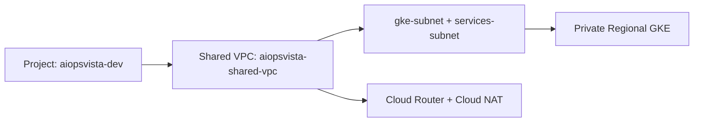

# Dev Environment - Landing Zone Foundation

Environment: `dev`  
Project ID: `aiopsvista-dev`  
Region: `us-central1`

## Scope
This environment provisions only the landing-zone and GKE foundation:
- Project and required APIs
- Shared VPC and private subnets
- Cloud NAT for private node egress
- Private regional GKE cluster with Workload Identity

Not included in this milestone:
- Application services
- AI services
- Observability stack deployment
- Data platform services

## Architecture Diagram


## Files
- `versions.tf`
- `providers.tf`
- `main.tf`
- `variables.tf`
- `outputs.tf`
- `terraform.tfvars.example`

## Validation Commands
```bash
terraform fmt -recursive
terraform validate
terraform plan -var-file=terraform.tfvars
terraform apply -var-file=terraform.tfvars
kubectl get nodes
```

## Definition of Done
1. Terraform plan succeeds.
2. Terraform apply succeeds.
3. Shared VPC exists.
4. Private GKE exists.
5. Workload Identity enabled.
6. `kubectl get nodes` returns healthy nodes.
